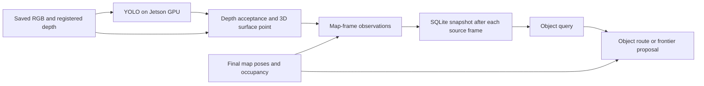

# Saved RGB-D To Search Demo

Status: `VERIFIED` on the Jetson, 2026-09-11. One command now runs actual GPU
perception on saved sensor frames, builds persistent memory prefixes and produces
an inspectable search timeline. This completes the first offline pipeline MVP.
It uses final saved map geometry and simulated planning starts; concurrent SLAM,
live observation feedback and physical navigation remain unverified.

## Run On This Jetson

Use the existing native `.venv`, local weights and measured room artifacts:

```bash
cd ~/projects/jetson-semantic-room-explorer
OMP_NUM_THREADS=2 OPENBLAS_NUM_THREADS=2 .venv/bin/python \
  scripts/run_rgbd_search_demo.py \
  --frames data/outputs/rtabmap_slam/colored_cloud_20260910/frames/frames.json \
  --model yolov8n.pt \
  --mapping data/outputs/rtabmap_slam/mapping_02 \
  --nodes 7 14 32 \
  --label bottle \
  --simulated-start-xy 1.65 0.08366 \
  --output data/outputs/rgbd_search/NEW_RUN
```

Choose a new output directory for each invocation. All inputs are already local
on this Jetson; room data and model weights are intentionally excluded from Git.
A fresh clone alone is insufficient to reproduce this measured room. The command
requires working CUDA access and has no CPU fallback or model download. No camera
driver, bag playback or ROS process is needed for this demonstration.

## Follow The Data



The entry point calls the existing [RGB-D producer](rgbd-object-observations.md)
and [observation replay](observation-search-replay.md). It adds stage reporting
and input/output identity checks; detection, depth filtering, memory association,
planning policy and rendering remain in their existing owners.

Start with `demo.json`: it records selected nodes, model/manifest hashes,
simulated start, stage statuses, JSON/PNG paths and the source-time search
timeline. Stage artifact paths are relative to the containing report's directory;
source input paths are absolute.

| Artifact inside the new run | What to inspect |
| --- | --- |
| `perception/observations.json` | Every detection and depth rejection, original timestamps, calibration, millimeter-to-meter conversion, camera/map points and model settings |
| `perception/node_ID.png` for nodes 7/14/32 | Actual RGB detections; green accepted depth, red rejected depth, selected surface pixels |
| `replay/replay.json` | Prefix import counts, memory hashes, source evidence and per-step decisions |
| `replay/node_ID/memory.db` | Persistent observations and provisional objects known at that prefix |
| `replay/node_ID/search/search.json` | Query, branch reason, candidate outcomes and linked goal/route/frontier evidence |

These measured outputs can be opened directly on the Jetson display:

```bash
xdg-open data/outputs/rgbd_search/demo_20260911/bottle/perception/node_14.png
xdg-open data/outputs/rgbd_search/demo_20260911/bottle/replay/node_7/search/frontier/frontier.png
xdg-open data/outputs/rgbd_search/demo_20260911/bottle/replay/node_14/search/route/object_4.png
```

They are ordinary PNGs and need no WebGL. The previously accepted Open3D point
cloud viewer remains available separately; this step adds no new viewer.

## Measured Result

The three original frames contain 1280x720 RGB and registered uint16 depth in
millimeters, where zero denotes invalid depth. These are aligned saved images, not an assumption
that the camera's native RGB and depth profiles have equal resolution.
RGB/depth skew is 2.972/3.398/3.216 ms. Fresh GPU inference produces **18
detections: 15 accepted depth observations and three rejections**, exactly matching
the preceding M5 evidence apart from timing. The final logical memory matches
M6: 18 observations, 13 supports, two overlaps and nine provisional objects.

From explicit simulated start **[1.65,0.08366] m**:

| Arriving node | Original source time (ns) | Bottle result |
| --- | --- | --- |
| 7 | 1789080208207783000 | Bottle depth rejected; `NOT_FOUND` → `EXPLORATION_READY`, frontier group 39 |
| 14 | 1789080215242330000 | Two accepted bottle observations; `FOUND` → `ROUTE_READY`, candidates 4/6 with 0.75/0.60 m paths |
| 32 | 1789080265488456000 | No new bottle evidence; candidates, source times, single-frame supports and routes preserved |

Chair produces object routes at every prefix. Absent backpack produces frontier
proposals at every prefix. The explicit simulated unknown-cell start
[-0.002109,-0.03223] m produces `INVALID_START`, then `NO_ROUTE` at both later
prefixes; no start is snapped into free space.

All **130 focused tests** pass: 92 search, 21 mapping/depth and 17 memory.
Fourteen new entry-point tests stub the GPU producer and PNG rendering while
executing real map validation, SQLite imports and search replay. Actual GPU
coverage comes from **11 fresh CLI invocations**, each bounded at 180 seconds:
five complete demos, one synthetic all-zero-depth case, three invalid-source
cases, missing start and output reuse. Six invocations run GPU perception.

Repeated bottle inference and timelines are identical apart from timing. Every
accepted axial depth equals its source depth pixel divided by 1000; independent
backprojection/map-transform checks differ by at most 8.882e-16 m. This validates
arithmetic and units, not physical position accuracy. Prefix databases contain
exactly [7], [7,14] and [7,14,32] and pass integrity/foreign-key checks. Original
inputs and previous evidence remain unchanged. All **66 PNGs** decode; all three
primary annotations, the first frontier and both node 14 bottle routes were
visually inspected. Existing apparent class errors and chair overlap remain.

Across the five complete three-frame demos, operation-time min/median/P95/max
is **12.491/18.375/23.037/23.404 s**; process wall time is
**14.868/20.722/25.503/25.896 s**. These small mixed normal/refusal runs include
loading, GPU startup/inference, validation, imports and image rendering. They do
not measure sustained FPS or concurrent resource use. Runtime: Python 3.10.12,
PyTorch 2.8.0, Ultralytics 8.4.112, OpenCV 4.11.0, NumPy 1.26.4 and SQLite 3.37.2
on aarch64 with the Orin GPU.

Local evidence is under `data/outputs/rgbd_search/demo_20260911/`: `integration.json`,
`verify_demo.py`, `verification.log`, GPU preflight, three test logs,
`final_check.json`, per-command logs and each run's artifacts. Fault fixtures
are explicitly synthetic copies and do not replace the measured sensor inputs.

## Outcomes And Limits

`DEMO_COMPLETE` (exit 0) means perception and every replay prefix completed.
Search refusals are completed decisions; it does not mean a target was physically
found. `NO_VALID_OBSERVATIONS` (exit 2) preserves all rejected detections and
skips memory/search. The synthetic zero-depth trial preserved 18 rejections and
created no replay. Source, GPU and replay errors propagate with nonzero exit;
once output exists, `demo.json` stays `INCOMPLETE` with the failing stage. Missing
arguments fail before output creation. Reusing output fails without modifying
the earlier evidence; an old successful report is not success for that invocation.

The first memory prefix still requires an accepted observation of some label.
Labels use the current YOLO vocabulary; identities and surface points remain
provisional. Final optimized poses and occupancy are shared across the timeline,
and observations were not acquired at the proposed search goals. Partial tracking,
floor/map accuracy, visibility and actual localization remain unresolved; all
48 recorded camera starts project into unknown grid cells. No physical movement
or new coverage is measured. CuTR, open-vocabulary queries and navigation remain
separate unverified milestones.

The lesson is that valid depth and traceable source evidence connect detection
to a search decision; a detected box alone cannot supply a map location.
The next action is a bounded concurrent SLAM/perception trial using the existing
rosbag, measuring source-time association, queue/drop behavior and Jetson resources.
